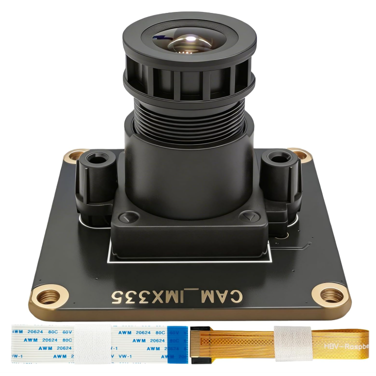

# CAM-IMX585-M MIPI Camera Module



## 1. Product Overview

The **CAM-IMX585-M** is a high-performance monochrome CMOS image sensor designed for demanding imaging applications in embedded systems. Featuring an advanced Starvis 2 back-illuminated pixel structure, this 8.3MP sensor delivers exceptional low-light performance, high dynamic range, and precise image quality across diverse lighting conditions.

With native 3840×2160 (4K UHD) resolution and support for 10/12/16-bit RAW output, the CAM-IMX585-M enables professional-grade imaging for surveillance, industrial inspection, machine vision, and embedded vision applications. The sensor's MIPI CSI-2 4-lane interface ensures reliable high-speed data transmission to host processors like Raspberry Pi 5 and NVIDIA Jetson.

*Note: While the sensor supports 10/12/16-bit RAW output, the current driver configuration operates in 12-bit RAW (R12_CSI2P) mode on Raspberry Pi 5.*

### 1.1 Key Features

- **8.3MP 4K resolution** with Starvis 2 technology
- **Monochrome sensor** for enhanced low-light sensitivity
- **MIPI CSI-2 4-lane** high-speed interface
- **10/12/16-bit RAW output capability** (currently 12-bit)
- **Excellent low-light performance** with back-illuminated pixels
- **Compatible with Raspberry Pi**

### 1.2 Industry Applications

- Security & Surveillance (24/7 monitoring)
- Industrial & Machine Vision (AOI, robotics)
- Broadcast & ProAV (live streaming, drones)
- Scientific & Medical (microscopy, diagnostics)
- Automotive (ADAS, surround-view cameras)

---

## 2. Hardware Specifications

### 2.1 Sensor Specifications

| Parameter | Specification |
| :--- | :--- |
| **Product Model** | CAM-IMX585-M |
| **Sensor Model** | Sony IMX585 (Monochrome) |
| **Sensor Type** | CMOS (Mono) |
| **Pixel Technology** | Starvis 2 |
| **Effective Resolution** | 8.3MP |
| **Optical Format** | 1/1.2" |
| **Pixel Size** | 2.9μm × 2.9μm |
| **Active Pixels** | 3840 (H) × 2160 (V) |
| **Max Resolution** | 3840×2160 (4K UHD) |
| **Supported RAW Output** | 10/12/16-bit |

### 2.2 Video Format & Resolution/Frame Rate

| Resolution | Frame Rate | Pixel Format | Notes |
| :--- | :--- | :--- | :--- |
| 1928×1090 | 30.00 fps | R12_CSI2P | Cropped from 4K |
| 3856×2180 | 30.00 fps | R12_CSI2P | Native sensor readout |

### 2.3 Interface & Physical Specifications

| Parameter | Specification |
| :--- | :--- |
| **Interface Type** | MIPI CSI-2 |
| **Data Lanes** | 4-lane |
| **Data Rate** | 1.5 Gbps per lane |
| **Connector** | 22-pin FPC |
| **Dimensions** | 38mm × 38mm |
| **Lens Mount** | CS-mount / M12 |

---

## 3. Software Installation

This repository provides the necessary drivers, Image Processing Algorithm (IPA) modules, and an automated installation script to enable full support for the IMX585 sensor on Raspberry Pi.

### 3.1 Repository Contents

- `imx585.ko`: Pre-compiled kernel driver module.
- `ipa/`: Directory containing pre-compiled IPA libraries for Raspberry Pi 4 (`ipa_rpi_vc4.so`) and Raspberry Pi 5 (`ipa_rpi_pisp.so`).
- `install_imx585.sh`: Automated installation script for the driver and IPA libraries.
- `pkg1-imx585-driver-6.12y-offline.tar.gz`: Offline driver build package.
- `pkg2-rpicam-libcamera-offline.tar.gz`: Offline libcamera build package.
- `pre-compiler-driver-ipa.tar.gz`: Pre-compiled driver and IPA package.

### 3.2 Automated Installation (Recommended)

The provided `install_imx585.sh` script automates the installation of the kernel driver and the appropriate IPA libraries for your Raspberry Pi model.

1. Clone the repository:
   ```bash
   git clone https://github.com/INNO-MAKER/CAM-IMX585.git
   cd CAM-IMX585
   ```

2. Make the script executable:
   ```bash
   chmod +x install_imx585.sh
   ```

3. Run the installation script with root privileges:
   ```bash
   sudo ./install_imx585.sh
   ```

The script will perform the following actions:
- Copy the `imx585.ko` driver to the appropriate kernel modules directory.
- Run `depmod -a` and load the driver using `modprobe`.
- Copy the correct IPA libraries (`ipa_rpi_pisp.so` for Pi 5 or `ipa_rpi_vc4.so` for Pi 4) to the system's `libcamera` directory.
- Verify the installation by checking loaded modules and V4L2 devices.

### 3.3 Offline Driver Compilation

For advanced users who need to compile the driver from source:

**Package**: `pkg1-imx585-driver-6.12y-offline.tar.gz`

**Contents**:
- `imx585-v4l2-driver/` - Kernel driver source code
- `install.sh` - Automated driver installation script

**Installation**:
```bash
$ tar -xzf pkg1-imx585-driver-6.12y-offline.tar.gz
$ cd pkg1-imx585-driver
$ chmod +x install.sh
$ sudo ./install.sh
```

### 3.4 Offline libcamera & rpicam-apps Compilation

For complete offline compilation of libcamera with IMX585 support and rpicam-apps:

**Package**: `pkg2-rpicam-libcamera-offline.tar.gz`

**Contents**:
- `libcamera-imx585/` - libcamera source with IMX585 IPA support
- `rpicam-apps-imx585/` - rpicam-apps source
- `build.sh` - Automated build and installation script

**Installation**:
```bash
$ tar -xzf pkg2-rpicam-libcamera-offline.tar.gz
$ cd pkg2-rpicam-offline
$ chmod +x build.sh
$ sudo ./build.sh           # Full mode with Qt support
$ sudo ./build.sh --lite    # Lite mode (minimal dependencies)
```

**Build Time**: ~30-40 minutes (full mode) or ~15-20 minutes (lite mode)

### 3.5 Manual Configuration

Edit your `/boot/firmware/config.txt` (Pi 5) or `/boot/config.txt` (Pi 4) and add one of the following configurations:

**Default (CAM1 port, Color mode)**:
```ini
camera_auto_detect=0
dtoverlay=imx585
```

**Use CAM0 port**:
```ini
dtoverlay=imx585,cam0
```

**Monochrome mode**:
```ini
dtoverlay=imx585,mono
```

**CAM0 + Monochrome**:
```ini
dtoverlay=imx585,cam0,mono
```

Reboot your Raspberry Pi for the changes to take effect:
```bash
$ sudo reboot
```

---

## 4. Testing the Camera

After installation and rebooting, you can verify the camera detection and test its functionality using the standard `rpicam-apps`.

### 4.1 Verify Detection

List the available cameras to ensure the IMX585 is detected correctly:

```bash
rpicam-hello --list-cameras
```

### 4.2 Capture Commands

**Live Preview:**
```bash
rpicam-hello -t 0
```

**Capture a 4K Image:**
```bash
rpicam-still -o 4k_image.jpg --width 3856 --height 2180
```

**Record a 4K Video (30fps):**
```bash
rpicam-vid -t 10000 --width 3856 --height 2180 -o 4k_video.h264
```

---

## 5. Support

For technical support, detailed documentation, and product inquiries, please visit [INNO-MAKER](https://www.inno-maker.com).
